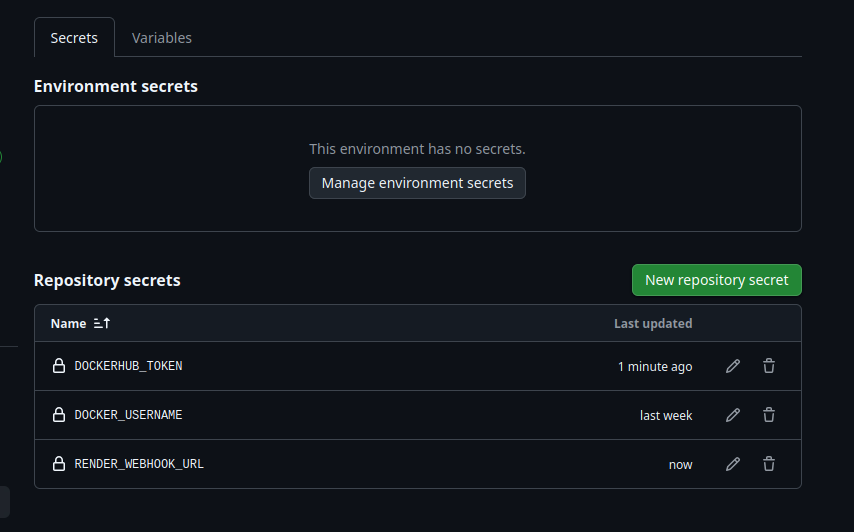
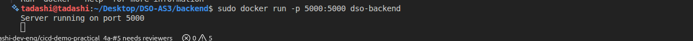
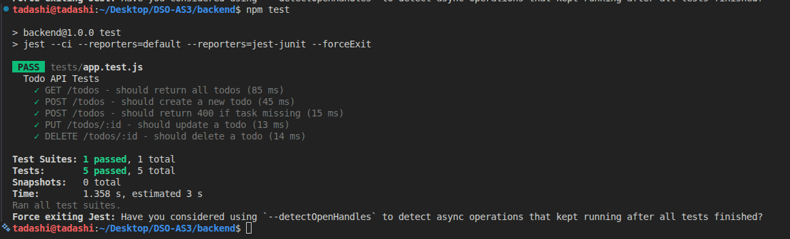
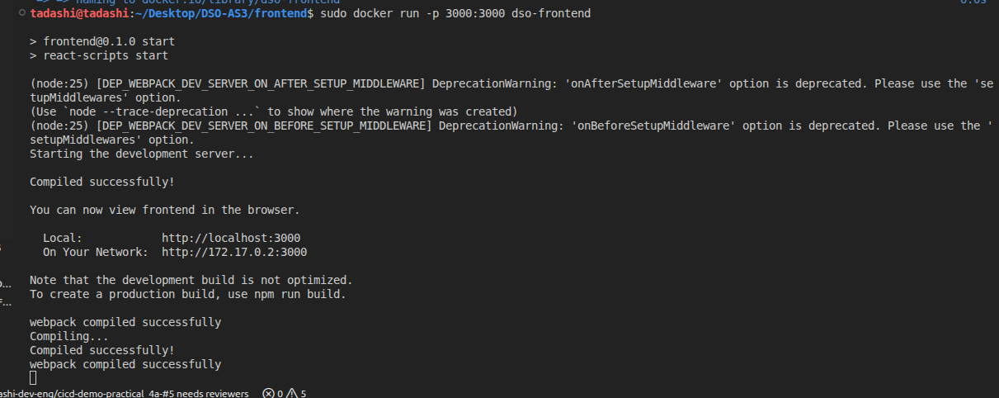
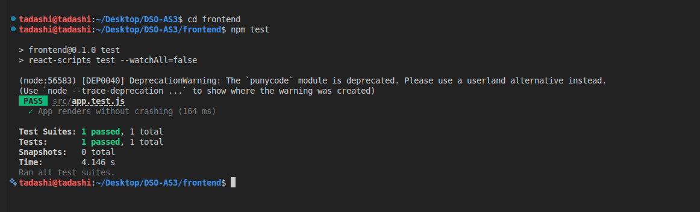
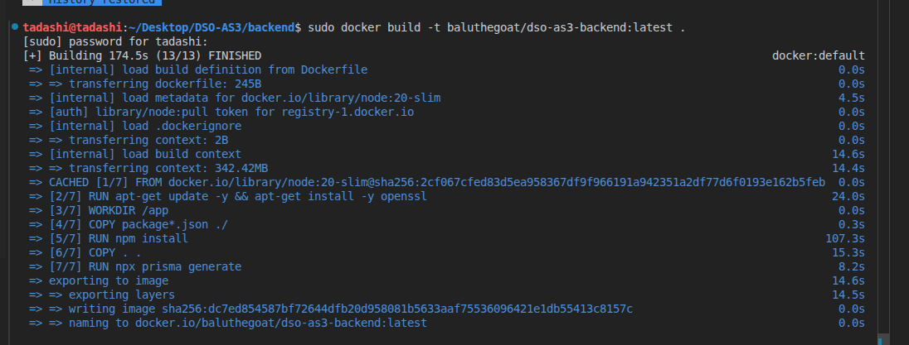
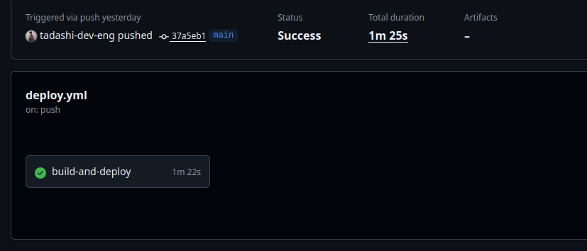
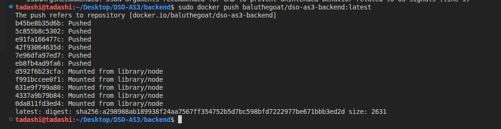
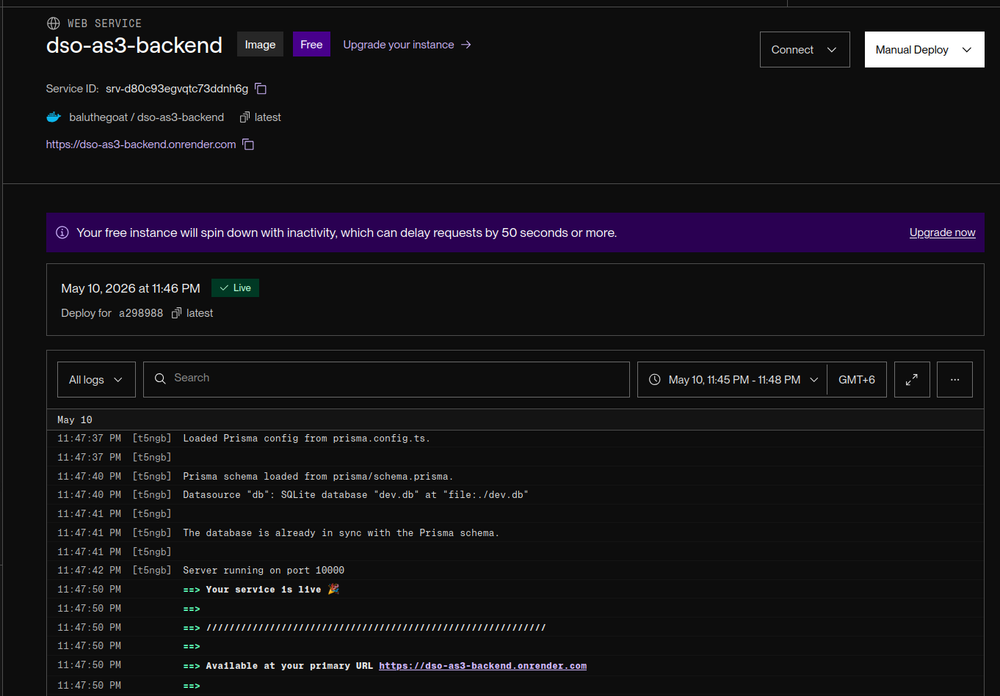
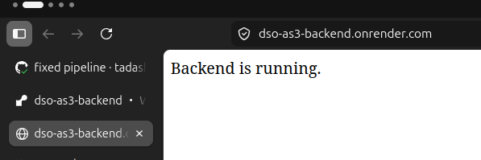

# Assignment 3 Report

### Backend

- Node.js with Express
- Prisma ORM
- SQLite via `@prisma/adapter-better-sqlite3`
- CORS support for cross-origin requests
- Environment configuration with `dotenv`
- Containerized using `backend/Dockerfile`

### Frontend

- React with Create React App
- React Router not used in current implementation
- Frontend package managed with npm
- Containerized using `frontend/Dockerfile`

### CI/CD and Deployment

- GitHub Actions workflow at `.github/workflows/deploy.yml`
- Docker image build and push to DockerHub
- Deployment trigger via Render webhook

---

## Backend Implementation

### `backend/server.js`

The backend exposes the following endpoints:

- `GET /` — root route to verify the backend is running
- `GET /health` — health check endpoint
- `GET /todos` — fetch all todo items
- `POST /todos` — create a new todo item
- `PUT /todos/:id` — update an existing todo item
- `DELETE /todos/:id` — delete a todo item

### Database

- Uses Prisma Client for database access
- Configured to use a local SQLite database by default
- Connection string is read from `process.env.DATABASE_URL`, with fallback to `file:./dev.db`

### Docker configuration

- `backend/Dockerfile` uses Node 20 slim
- Installs dependencies and generates Prisma client
- Exposes port `5000`
- Runs `npx prisma db push` before starting the server

---

## Frontend Implementation

### `frontend/package.json`

- Uses React 19 and React Scripts 5
- Scripts:
  - `npm start`
  - `npm build`
  - `npm test`

### Docker configuration

- `frontend/Dockerfile` builds the React app inside Node 20 Alpine
- Installs dependencies and runs tests
- Exposes port `3000`
- Starts the app with `npm start`

---

## CI/CD Pipeline

### Workflow steps

The GitHub Actions workflow performs the following actions on push to `main`:

1. Checkout repository
2. Set up Node.js 20
3. Install backend dependencies
4. Generate Prisma client
5. Run backend tests
6. Set up Docker Buildx
7. Log in to DockerHub using secrets
8. Build and push backend Docker image
9. Trigger Render deployment via webhook

### Required secrets for the assignment are : 

- `DOCKERHUB_USERNAME`
- `DOCKERHUB_TOKEN`
- `RENDER_WEBHOOK_URL`



---

## Local Setup and Testing

### Backend

```bash
cd backend
npm install
npm test
npm start
```
- Running the backend on port 5000



- When testing the backend it passed all the 5 test that has the CURD operations. 
  


### 8.2 Frontend

```bash
cd frontend
npm install
npm start
```
- Running the frontend on port 3000


- When testing the frontend it passed all the test.



### Docker
- In this process I have created the docker image and tested locally by exposing the port 5000 before pushing it to the docker hub for deployment. 

```bash
docker build -t baluthegoat/dso-as3-backend:latest .
```


```bash
docker run -p 5000:5000 baluthegoat/dso-as3-backend:latest
```


---

## 


## CI/CD and Deployment
- The Github actions pipeline passed successfully on main.



- Build the backend image and push to DockerHub



[Docker image can be access here](https://hub.docker.com/repository/docker/baluthegoat/dso-as3-backend/general)

### Render

- Create a Render service from an existing Docker image
- Use the pushed DockerHub image
- Configure deployment webhook and store the URL as a GitHub secret





[Live URL can be assess here](https://dso-as3-backend.onrender.com)

---

## Challenges

- Connecting the backend to a deployable, containerized database layer
- Ensuring the CI workflow generates Prisma client artifacts before tests
- Keeping cloud deployment secrets secure and out of source control
